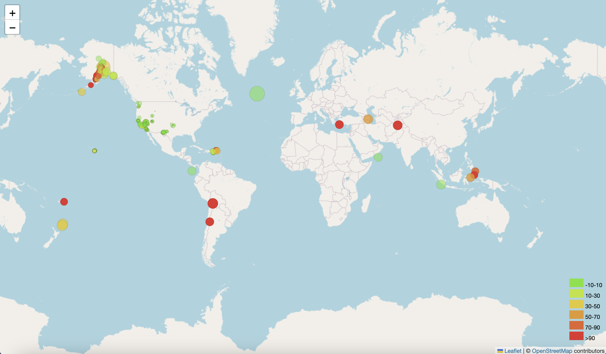

# Leaflet Challenge

## Overview

In this challenge, I created a map using JavaScript to visualize USGS earthquake data. This particular map pulls all USGS earthquake data from the past day from around the world (updated continuously). You can find my script in static/js/logic.js. You can see the map by opening index.html in a browser tab.

## Map

The markers for the earthquakes visualize both the magnitude and depth of each earthquake. There is a legend in the bottom right corner that details what depth range each color symbolizes. Additionally, marker size is relative to earthquake magnitude. 

